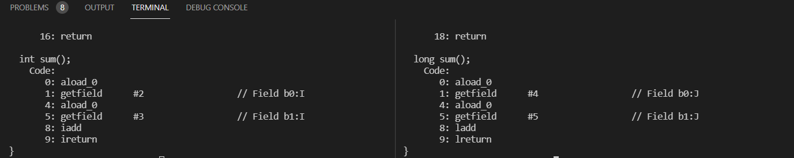

# Answer

In the two method, the difference in the bytecode is as follows:

* In **StrangeOne**, inside the sum method, having integers, it's used the **iadd** to do the sum and the **ireturn** to return the result

* In **StrangeTwo**, inside the sum method, having longs, it's used the **ladd** to do the sum and the **lreturn** to return the result

